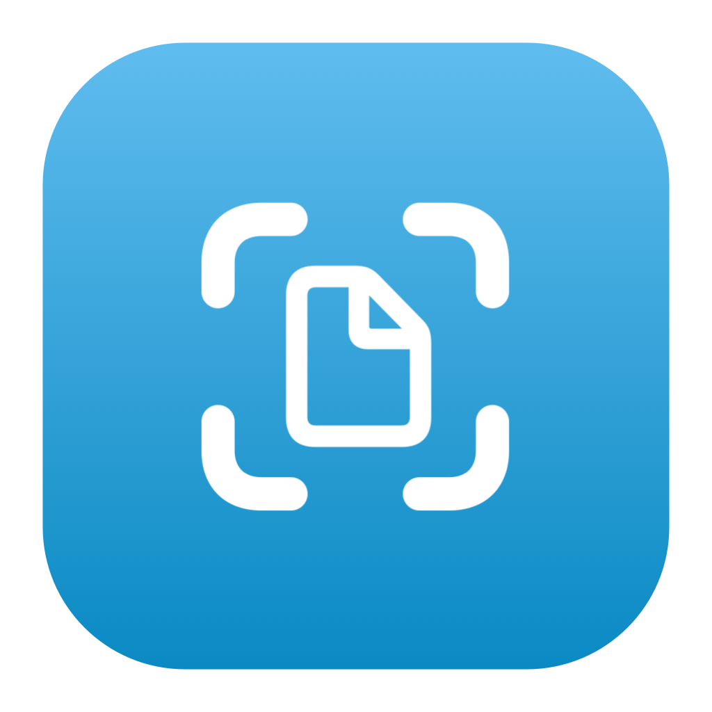
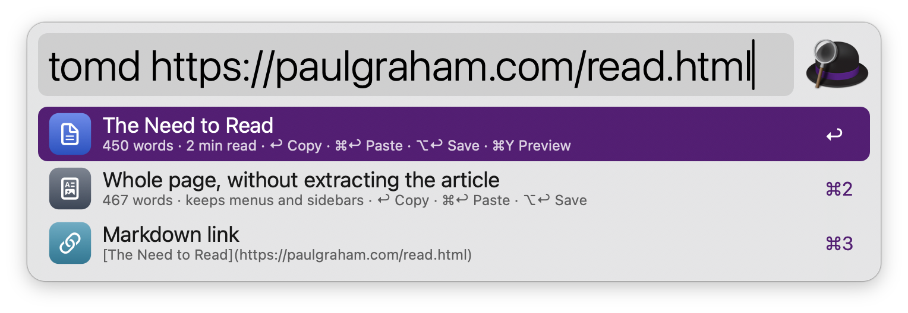
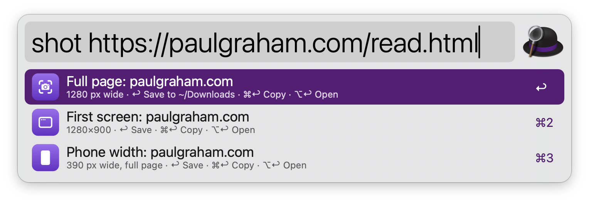
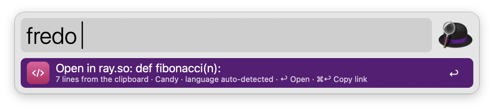
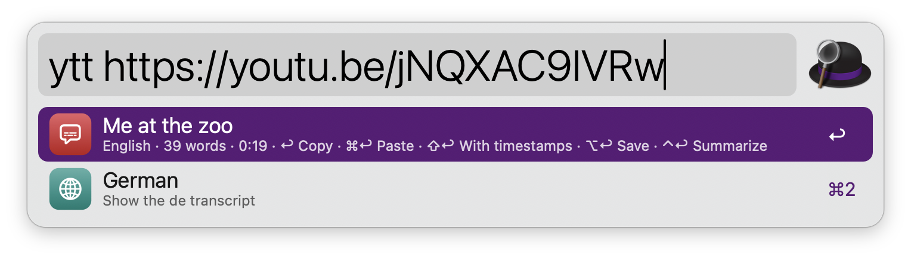

#  Web Capture

Capture the web from Alfred: turn a page into clean Markdown, take a full-page screenshot, make a code image with ray.so, or get the transcript of a YouTube video. No dependencies: everything runs on tools that ship with macOS.

## Setup

Converting pages behind a login is optional. It reads the page from your browser instead of downloading it, so the browser must accept JavaScript from Alfred:

* Safari: turn on Settings › Advanced › “Show features for web developers”, then Develop › “Allow JavaScript from Apple Events”.
* Chrome, Brave, Edge, Vivaldi, Arc and other Chromium browsers: View › Developer › “Allow JavaScript from Apple Events”.

Then turn on “Use browser page content” in the Workflow’s Configuration.

## Usage

The Markdown, screenshot and transcript commands work on the URL typed after their keyword. Leave it empty to use the frontmost tab of Safari, Chrome, Arc, Brave, Edge, Vivaldi, Opera, Orion, Dia, Comet or Helium. Firefox and Zen can’t share their tabs, so copy the URL first: a URL in the clipboard is used when no browser tab is available.

### Markdown

Convert a web page to clean Markdown via the `tomd` keyword. Web Capture finds the article and drops menus, ads and sidebars. It keeps headings, nested lists, tables, code blocks with their language, quotes, images and links (made absolute), and adds YAML front matter with the title, URL, author and date.



* <kbd>↩</kbd> Copy the Markdown.
* <kbd>⌘</kbd><kbd>↩</kbd> Paste the Markdown into the frontmost app.
* <kbd>⌥</kbd><kbd>↩</kbd> Save it as a .md file in the folder set in the Workflow’s Configuration.
* <kbd>⌘</kbd><kbd>Y</kbd> Quick Look the Markdown.

The whole page (without extracting the article) and a Markdown link to the page are offered below. Plain text and Markdown files are copied as they are, and JSON, CSV or XML go in a code block.

Alternatively, convert a URL via the Universal Action.

### Screenshots

Take a full-page screenshot via the `shot` keyword. The page is rendered in the background with the WebKit built into macOS, lazy-loaded images included, at the width set in the Workflow’s Configuration. You can also capture only the first screen, or the page at a phone’s width.



* <kbd>↩</kbd> Save the PNG and reveal it in Finder.
* <kbd>⌘</kbd><kbd>↩</kbd> Copy the image.
* <kbd>⌥</kbd><kbd>↩</kbd> Save the PNG and open it.

Screenshots don’t use your browser’s logins or cookies.

Alternatively, capture a URL via the Universal Action.

### Code Images

Turn the code in the clipboard into an image with ray.so via the `code` keyword. Type a language after the keyword (like `code py`) to set it, or leave it empty and ray.so detects it. The theme, padding, dark mode, background and line numbers are set in the Workflow’s Configuration.



* <kbd>↩</kbd> Open the code in ray.so.
* <kbd>⌘</kbd><kbd>↩</kbd> Copy the ray.so link.

Alternatively, turn selected code into an image via the Universal Action.

### YouTube Transcripts

Get the transcript of a YouTube video via the `ytt` keyword. Captions written for the video in your languages (set in the Workflow’s Configuration) come first, then auto-generated ones. The other languages are listed below the transcript: type a language code after the URL (like `ytt https://youtu.be/… de`) to pick one, and add `auto` for auto-generated captions.



* <kbd>↩</kbd> Copy the transcript as paragraphs.
* <kbd>⌘</kbd><kbd>↩</kbd> Copy the transcript with timestamps.
* <kbd>⌥</kbd><kbd>↩</kbd> Save it as Markdown with timestamp links, or as plain text.
* <kbd>⌃</kbd><kbd>↩</kbd> Summarize it with the Local AI workflow, when it is installed.
* <kbd>⌘</kbd><kbd>Y</kbd> Quick Look the transcript.

Alternatively, get the transcript of a YouTube URL via the Universal Action.

Every keyword can be changed in the Workflow’s Configuration.

## Development

```bash
swift tools/make_icons.swift tools/icons.json src   # regenerate icons
python3 tools/build.py --package                     # write src/info.plist and dist/*.alfredworkflow
python3 tests/test_webcapture.py                     # run the tests (WC_LIVE=1 adds live network tests)
```

## AI disclosure

This workflow was developed with the help of Claude (Anthropic), an AI assistant. The code is reviewed and tested by the author.
